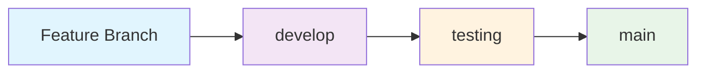

# Git Branching Strategy

## Branch Structure

This repository follows a professional **Git Flow** branching strategy with three main branches:

### 🌟 **Main Branches**

#### `main` (Production)
- **Purpose**: Stable, production-ready code
- **Protection**: Direct pushes are disabled
- **Merges**: Only from `develop` branch via Pull Requests
- **Tags**: Release versions are tagged here
- **Content**: Clean, tested, deployable code

#### `develop` (Development)
- **Purpose**: Integration branch for new features
- **Protection**: Direct pushes allowed for developers
- **Merges**: Feature branches merge here first
- **Content**: Latest development changes, may be unstable

#### `testing` (Quality Assurance)
- **Purpose**: Testing and validation branch
- **Protection**: Direct pushes allowed for testing
- **Merges**: Stable features from `develop`
- **Content**: Features ready for testing, pre-release validation

### 🔄 **Workflow**



### 📋 **Branch Usage Guidelines**

#### **For Development:**
1. Create feature branches from `develop`
2. Work on features in isolation
3. Merge back to `develop` when complete
4. Never commit directly to `main`

#### **For Testing:**
1. Merge stable features from `develop` to `testing`
2. Run comprehensive tests on `testing` branch
3. Validate all functionality before release
4. Document any issues found

#### **For Releases:**
1. Merge tested code from `testing` to `main`
2. Tag the release version
3. Create release notes
4. Deploy to production

### 🚀 **Current Repository State**

- **Main**: Clean production code (32 essential files)
- **Develop**: Development integration branch
- **Testing**: Quality assurance branch

### 📁 **File Organization by Branch**

#### **All Branches Contain:**
- Core installer scripts (9 files)
- Rust TUI application (3 files)
- Test suite (8 files)
- Documentation & CI/CD (6 files)
- Plymouth themes (Source/)

#### **Branch-Specific Content:**
- **main**: Production-ready, stable code only
- **develop**: New features, experimental code
- **testing**: Test configurations, validation scripts

### 🔧 **Commands**

```bash
# Switch between branches
git checkout main
git checkout develop
git checkout testing

# Create new feature branch
git checkout develop
git checkout -b feature/new-feature

# Merge to testing
git checkout testing
git merge develop

# Merge to main (for releases)
git checkout main
git merge testing
git tag v1.0.0
```

### 📝 **Best Practices**

1. **Always pull latest changes** before starting work
2. **Use descriptive commit messages**
3. **Test thoroughly** before merging to main
4. **Keep branches clean** - no build artifacts
5. **Document breaking changes** in commits
6. **Use semantic versioning** for tags

### 🎯 **Benefits of This Strategy**

- ✅ **Clean separation** of concerns
- ✅ **Stable main branch** for production
- ✅ **Organized development** workflow
- ✅ **Easy rollbacks** if needed
- ✅ **Professional structure** for collaboration
- ✅ **Automated testing** on each branch
